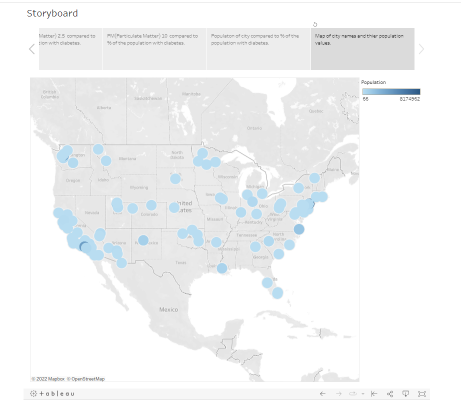
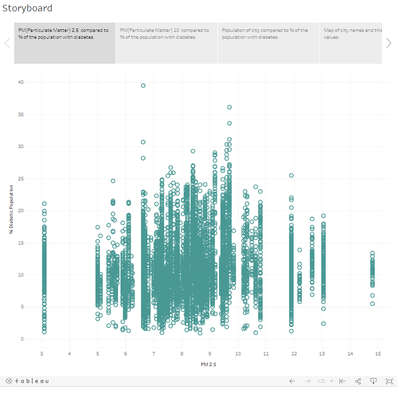

# group_7_project

Alyssa Stringer, Juana Suarez, Kelly Maluccio

## Project Content

Below is a list answering basic questions about our project and describing our plan for the project.

Selected topic: 
- We are predicting common diseases that impact majority of Americans, such as diabetes, cancer and asthma, based on air quality from 500 different U.S. cities

Reason for topic: 
- Being health conscious is important to our group members. Whether cancer, obesity, or mental health, we all know someone close to us who suffers from health issues. The conversation led us to a discussion about external factors affecting health. How does air quality, population, and state predict the prevalence of various diseases in cities? 

Description of source data: 
- Our group found data from the [CDC website](https://www.cdc.gov/places/) on diseases, and data from the World Health Organization on air quality data through [Kaggle](https://www.kaggle.com/datasets/erelin6613/ambient-air-quality-database-who?resource=download). We were able to merge both data sets by city. Our project will be able to predict disease based on air quality, location, and population and identify the most affected cities with various diseases. 
-  Additional Resources: Follow this link to read an article that describes particle matter (PM) and its effect on health.
[Particle Matter and Health](https://ww2.arb.ca.gov/resources/inhalable-particulate-matter-and-health)

Question(s) we want to answer: 
- Can we predict disease, such as diabetes or cancer, based on the city's air quality, state, and population?

## Presentation
[Link to Google Slides presentation](https://docs.google.com/presentation/d/1qG3MhF2sn1fkCNRhy3UWNuz9jSNbHSO7k6iK9xUxawY/edit?usp=sharing)

## GitHub and Communication

For our project, we agreed to work together during class time and designate roles with specific tasks so that each group member has a fair amount of work to complete. Some tasks take more effort and need to be completed as a team or with at least two group members. Our communication is primarily through our Slack group chat, and we also have a shared folder in Google Drive where we keep a notes document about the project and tasks that we have completed. We will also create our google slides presentation in this folder. We created a new GitHub repository, and each of us started an individual branch for the first segment. We have agreed to message in Slack when we work on something for the project or if we make any commits to our branch so that the group knows and can check the GitHub page for updates. We will not merge any of our branches to the main branch until the code runs without error and we all agree with the files. Lastly, we meet on zoom if we need to meet outside of class time/office hours.

## Data Exploration
We first loaded two of our datasets into a Python file in order to use pandas to explore and clean the data. We are exploring the data with python and pandas before loading the two separate datasets into pgAdmin and using SQL to join these two datasets together in order to have one set of data to work with. 

In order to make sense of our data, we needed to understand the metrics given to us in each data set and what exactly those metrics mean.

**Air Quality data metrics that determine air quality**:
- **PM10** is any particulate matter in the air with a diameter of 10 micrometers or less, including smoke, dust, soot, salts, acids, and metals.
- **PM2.5** is fine particulate matter. PM2.5 is an air pollutant that is a concern for people's health when levels in air are high. PM2.5 are tiny particles in the air that reduce visibility and cause the air to appear hazy when levels are elevated.

Therefore, high levels of PM2.5 or PM10 is what we are looking for that we believe correlates with high levels of disease based on location.

**Diabetes data metrics**:
- **Data Value Type** is between two types of rates that are utilized in the MOPHIMS MICA system: crude and age-adjusted rates.

    - **Crude Prevalence** is defined as the total number of events, or count, divided by the mid-year total population of the selected geography and multiplied by a constant, which is a multiple of 10.

    - Age-Adjusted rates allows fairer comparisons to be made between groups with different age distributions. So if there are more elderly people in the population, there could be higher disease rates.

- **Data Value** is the number value given based on the above rates, or the percentage of people with the disease.

We first wanted to combine the WHO air quality dataset with just one of our diseases data, so we started off with the diabetes data since we discovered that PM 2.5 (air quality) is the most significantly linked to diabetes. We used pandas and python to load the two raw data CSV files into a python script before cleaning the data. 

We decided to keep the following columns from the WHO air quality data:
- Country
- City
- pm10
- Year
- pm2.5
- Latitude
- Longitude
- Population
- date_compiled
- color_pm2.5
- color_pm10

We decided to keep these columns because this is the complete list of relevant data we need to help our analysis. We need the city, country, year, latitude and longitude in order to determine the city and gather the same information from each city that we will get from the disease dataset. We needed the pm10 and pm2.5 data to represent the particle matter in the air which is directly related to air quality.  

We decided to keep the following columns from the diabetes data:
- Year
- StateDesc (state)
- CityName
- UniqueID
- Data_Value_Type
- Data_Value
- Low_Confidence_Limit
- High_Confidence_Limit
- PopulationCount
- GeoLocation

We need the location columns in order to join and match with the WHO air quality data location. We also needed the Data_Value and Data_Value_Type for analysis, these columns represent the percentage of people with diabetes in each particular city.

We then dropped all other columns that are not listed above. All other columns were repetitive, did not give us valuable information, had null or NAN values, or would confuse the machine learning model. 

We then renamed the columns to all be lowercase in both air_data_df (referred to as WHO air quality data) and diabetes_data_df. This is because SQL will not join tables unless the column names are all the same case level.

**Further filtering and cleaning of the data included**:
- Filter air_data_df for just the United States of America since we are only looking at US cities, dropped the rest.
- Drop the “-” next to the city names in air_data_df in order to match the city names to the diabetes_data_df.
- Drop NA in the air_quality_df and check the shape of the dataframe to see how many rows were dropped, there were no NAs in air_quality_df. We dropped NAs in the diabetes_data_df as well and checked the shape of the dataframe. 
- Filter the air_quality_df to only the year 2016 in order to match it closest to the year 2017 which is the year of the data for diabetes_data_df.

## Database

For our database, we first loaded the raw data (CSV files) for the air quality and diabetes data into python. In python, we created two dataframes with the necessary columns for the data analysis. This is where we cleaned the data and then used SQL Alchemy to store the data as two tables in pgAdmin. Once the python code runs, then we go to the schema.sql file and run the code that joins the two tables together. This merged table is exported to a CSV file which we connect to Tableau. If we paid for the service, we could connect to the server in Tableau and would not need to export another CSV file to access our database.

## Machine Learning Model

According to [this study](https://www.ncbi.nlm.nih.gov/pmc/articles/PMC5583950/#:~:text=The%20positive%20associations%20between%20PM,25%25%20in%20the%20long%E2%80%90term), PM 2.5 is the most significantly linked to diabetes. The Results section says, "every 10-μg/m3 increase in PM2.5, the risk of type 2 diabetes mellitus would increase by 25% in the long-term exposure." Our group looked at PM 2.5 and PM 10 data to see if it would predict the percentage of the population with diabetes. 

The formula for multiple linear regression is:

Benchmarks according to the WHO_AirQuality_Database_2018.csv for pm 2.5 and  pm 10: 

Green  = Air quality is satisfactory, and air pollution poses little or no risk.

Yellow = Air quality is acceptable. However there may be a risk for some people, particularly those who are unusually sensitive to air pollution. 

Orange = Members of sensitive groups may experience health effects. The General public is less likely to be affected. 

Dark Red = Some members of the general public may experience health effects; members of sensitive groups may experience more serious health effects.

pm 2.5:
- <10 = green
- 10-<15 = yellow
- 15-<25 = orange

pm 10 
- <20 = green
- 20 - <30 = yellow
- 30-<50 = dark red

In our multiple linear regression model our data points are the following:

Y = % of the population that is diagnosed diabetic [data_value]

X1 = pm 10 air quality level [“pm10”]

X2 = pm 2.5 air quality level  [“pm25”]

X3 = Population ["population"]

X4 = State ["state"]

To split into training and testing sets, we will use sklearn.model_selection.train_test_split with the features above. Reference this [medium article](https://medium.com/@sametgirgin/multiple-linear-regression-model-in-7-steps-with-python-f02dbb13c51e) as an example of a multiple linear regression with test and train data. 

We chose the multiple linear regression model because it fits the needs of our data set. The benefit of linear regression is that it’s not as complex as other advanced machine learning models, and it’s easier for our viewers to understand. We have multiple X variables to help us predict on y variables. We want to predict the % of the population that is diabetic based on population, location, and air quality. One limitation of this model is that other variables influence being diabetic that we are not testing, which can weaken the predictability. 

## Dashboard

To create our storyboard we are using Tableau as our tool. We connect Tableau to our database and then create visualizations for the storyboard. Our interactive elements will be the visualizations of our data including a map of all US cities that are in the dataset and graphs to compare the particle matter values for each city with percentage of the population with diabetes.

[Link to Tableau Public](https://public.tableau.com/shared/CM5SFSS4M?:display_count=n&:origin=viz_share_linK)

Interactive elements:
Hover over each city bubble to see air quality level, and the percentage of people with diabetes in that city.

