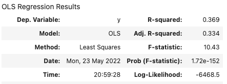
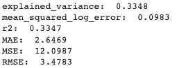
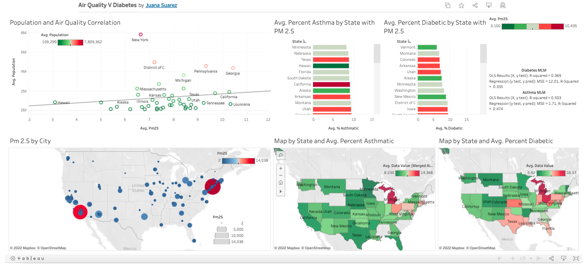

# group_7_project

Alyssa Stringer, Juana Suarez, Kelly Maluccio

## Project Content

### Selected topic: 
- We are predicting common diseases that impact majority of Americans, such as diabetes, asthma or cancer, based on air quality from 500 different U.S. cities

### Reason for topic: 
- Being health conscious is important to our group members. Whether cancer, obesity, or mental health, we all know someone close to us who suffers from health issues. The conversation led us to a discussion about external factors affecting health. How does air quality, population, and state predict the prevalence of various diseases in cities? 

### Description of source data: 
- Our group found data from the [CDC website](https://www.cdc.gov/places/) on diseases, and data from the World Health Organization on air quality data through [Kaggle](https://www.kaggle.com/datasets/erelin6613/ambient-air-quality-database-who?resource=download). We were able to merge both data sets by city. Our project will be able to predict disease based on air quality, location, and population and identify the most affected cities with various diseases. 
-  Additional Resources: Follow this link to read an article that describes particle matter (PM) and its effect on health.
[Particle Matter and Health](https://ww2.arb.ca.gov/resources/inhalable-particulate-matter-and-health)

### Question(s) we want to answer: 
- Can we predict disease, such as diabetes or asthma, based on the city's air quality, state, and population?
- Does air quality and diabetes or air quality and asthma have any correlation?
- Looking at these 500 US cities, what can we say about the percentage of disease in those locations using the air quality data?
- Should one consider air quality when moving to a particular city?

# Project Outline:
1. To begin this project, we wrote python code to organize the raw data so that we could load it into a SQL database to perform our analysis. This process is described in more detail in the database section below.

2. In a Jupyter Notebook python file, we read in the data from our database to start the machine learning model process. We dropped the low and high confidence limit since these metrics represent a minimum and maximum for the value we are trying to predict, therefore this would add strong bias to the model and it would predict perfectly.

3. Next we created three different dataframes to scale our data for the machine learning model. We used **OneHotEncoder** to scale the columns that are objects: color_pm25 (colors to indicate high, medium or low PM2.5 levels for air quality), color_pm10 (colors to indicate high, medium or low PM10 levels for air quality) and data_value_type (two different types described below).
        
        Air Quality data metrics that determine air quality:
        - PM10 is any particulate matter in the air with a diameter of 10 micrometers or less, including smoke, dust, soot, salts, acids, and metals.
        - PM2.5 is fine particulate matter. PM2.5 is an air pollutant that is a concern for people's health when levels in air are high. PM2.5 are tiny particles in the air that reduce visibility and cause the air to appear hazy when levels are elevated. 
     
        Therefore, high levels of PM2.5 or PM10 is what we believe correlates with high levels of disease based on location.

        Diabetes data metrics:
        Data Value Type is between two types of rates that are utilized in the MOPHIMS MICA system: crude and age-adjusted rates:
        1. Crude Prevalence is defined as the total number of events, or count, divided by the mid-year total population of the selected geography and multiplied by a constant, which is a multiple of 10.
        2. Age-Adjusted rates allows fairer comparisons to be made between groups with different age distributions. So if there are more elderly people in the population, there could be higher disease rates.
        - Data Value is the value given based on the above rates, or the percentage of people with the disease.

4. We used **pandas get_dummies** to scale the city, state and unique zip since these features have more than 2 or 3 unique entries. After running our code with these columns, it took about 18 minutes to train and test the data. Due to time constraints and errors that we needed to fix to calculate an accuracy score, we ended up dropping the unique zip (zip code) column. 

5. We used **StandardScaler** to scale the columns pm10, pm2.5 and population so that the model is given similar values to learn and predict using the given data.

6. Now with the three scaled datasets, we combined them together using concat to create a new, scaled dataframe ready to be used for Machine Learning and to upload into our SQL database.

7. Below we describe the machine learning model and describe the results along with recommendations for further analysis.

8. Finally, we created a dashboard in Tableau public and a google slides presentation - both links are given in sections below.

## Machine Learning Model

According to [this study](https://www.ncbi.nlm.nih.gov/pmc/articles/PMC5583950/#:~:text=The%20positive%20associations%20between%20PM,25%25%20in%20the%20long%E2%80%90term), PM 2.5 is the most significantly linked to diabetes. The Results section says, "every 10-μg/m3 increase in PM2.5, the risk of type 2 diabetes mellitus would increase by 25% in the long-term exposure." Our group looked at PM 2.5 and PM 10 data to see if it would predict the percentage of the population with diabetes or asthma. The code and process is the same for analyzing both diabetes and asthma since we could replace the diabetes data with asthma data then run the analysis again.

### Splitting our data into X and y
- y = data_value: The percentage of people in that city with Diabetes (or asthma)
- X_i = remaining scaled features:
    - color_pm10
    - color_pm25
    - data_value_type
    - population
    - pm25
    - pm10
    - city
    - state

The formula for multiple linear regression is:

where the X values represent our features and y is what we want to predict based on those features.

Benchmarks according to the WHO_AirQuality_Database_2018.csv for pm 2.5 and  pm 10: 

Green  = Air quality is satisfactory, and air pollution poses little or no risk.

Yellow = Air quality is acceptable. However there may be a risk for some people, particularly those who are unusually sensitive to air pollution. 

Orange = Members of sensitive groups may experience health effects. The General public is less likely to be affected. 

Dark Red = Some members of the general public may experience health effects; members of sensitive groups may experience more serious health effects.

pm 2.5:
- <10 = green
- 10-<15 = yellow
- 15-<25 = orange

pm 10 
- <20 = green
- 20 - <30 = yellow
- 30-<50 = dark red

### Splitting into training and testing sets

To split into training and testing sets, we use sklearn.model_selection.train_test_split with the features above. Reference this [medium article](https://medium.com/@sametgirgin/multiple-linear-regression-model-in-7-steps-with-python-f02dbb13c51e) as an example of a multiple linear regression with test and train data. 

### Fitting the Model
It took 0.023708 seconds to fit the model, run on a computer with memory: 4 GB 1600 MHz DDR3 and processor: 1.6 GHz Dual-Core Intel Core i5. Note that when we included unique zip as a feature in our model, it took 17 minutes 28 seconds to fit the model, so by removing this one feature it allowed for us to run the model in a timely manner.

### Results: Diabetes Data
#### Initial OLS Regression Results using y_test and X_test

#### Modified OLS Regression Results

R-squared is a statistical measure ranging from 0 to 1 where 1 means the data is perfectly correlated and 0 means the data has no correlation. We want this value to be as close to 1 as possible, which means our initial R-squared of 0.069 was our benchmark and we made changes to better fit our model and improve the accuracy. Our initial result of 0.069 means our data has almost no correlation. However, when we added city and state back into the features for X, we ran the code again to get a new R-squared equal to 0.369 which improved tremendously. Thus, this shows that the city and state are important features in our model and there is some correlation between air quality, location, population and diabetes.

#### Initial Sklearn.metrics using y_test and y_pred

#### Modified Sklearn.metrics using y_test and y_pred

Mean absolute error (MAE): represents the difference between the original and the predicted values by averaging their absolute difference of the whole dataset

Mean squared error (MSE): represents the difference between the original and predicted values, by squaring the average difference over the dataset

We want the MAE and MSE numbers to be as close to 0 as possible. As you can see by the images, in our initial model these numbers were high with MSE = 16.94 and a low R-squared value of 0.068 meaning our model was not predicting the percent diabetic accurately. Once we ran this metric with the modified version, to include city and state, our MSE decreased to 12.1 and R-squared value changed to 0.335 meaning the model is making a more accurate prediction.

### Results: Asthma Data

Using the same model, replacing the diabetes data with the asthma data we were able to get similar results. We knew to include city and state as features so we present only this result. The R-squared value using the test data was 0.503 meaning there is a correlation between air quality, location, population and asthma. Metrics for the test and predicted y values resulted in R-squared = 0.474 and MSE = 1.71 meaning there is little difference in the test and predicted values for percent of the population with asthma.

Lastly, our results showed us that there is some correlation between the features air quality, location and population with diabetes and asthma. However, the correlation is weak due to the fact that there are many more features causing these diseases and we have only taken a small snapshot of data for our specific features.

### Recommendations for further analysis

Given the time constraints of this project, we have the following recommendations to try improving the analysis results:
- Try using a different machine learning model, such as clustering. To do this, you run PCA (principal component analysis) using the trained and tested data and then cluster using K-means. Begin by trying k=3 and analyze the result
- Add more features to your data that may help to predict the diabetes or asthma percentage such as sleep, age, or other habits of people in each city
- Gather more data for the model to get a better picture of certain features such as air quality in each location

## Dashboard in Tableau

[Link to Tableau Public](https://public.tableau.com/views/AirQualityVDiabetes/Dashboard1?:language=en-US&publish=yes&:display_count=n&:origin=viz_share_link)

A screenshot of the Tableau dashboard with maps and visualizations of our data. Select the link to learn more and use the interactive elements.

## Presentation
[Link to Google Slides presentation](https://docs.google.com/presentation/d/1qG3MhF2sn1fkCNRhy3UWNuz9jSNbHSO7k6iK9xUxawY/edit?usp=sharing)

## Database

To create our database, we load in the raw data (CSV files) for the air quality, diabetes and asthma data into python. In python, we created two dataframes with the necessary columns for the data analysis (we did this for air quality and diabetes, then again for air quality and asthma). Here we cleaned the data and then used SQL Alchemy to store the data as two tables in pgAdmin. Once the python code runs, we use the query written in the schema.sql file and run the code that joins the two tables together. This merged table is exported to a CSV file which we connect to Tableau for our dashboard. NOTE: If we paid for the service, we could connect to the server in Tableau and would not need to export another CSV file to access our database.

