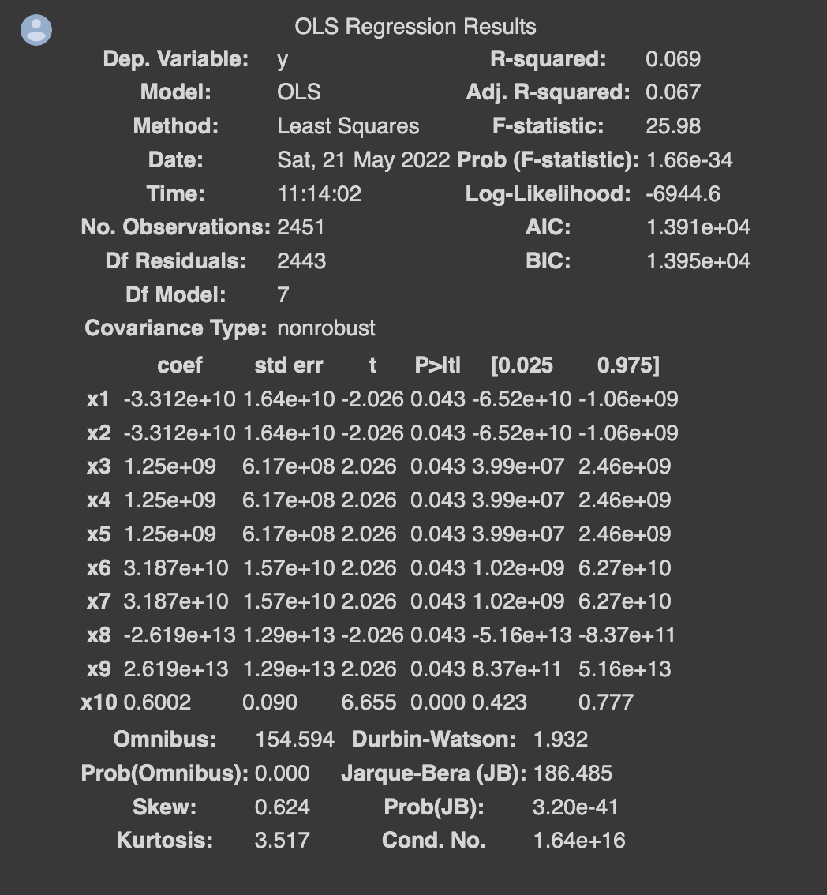
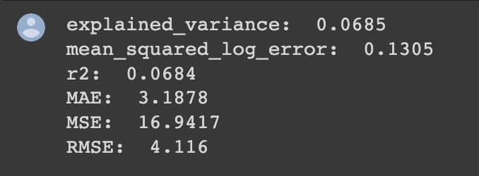
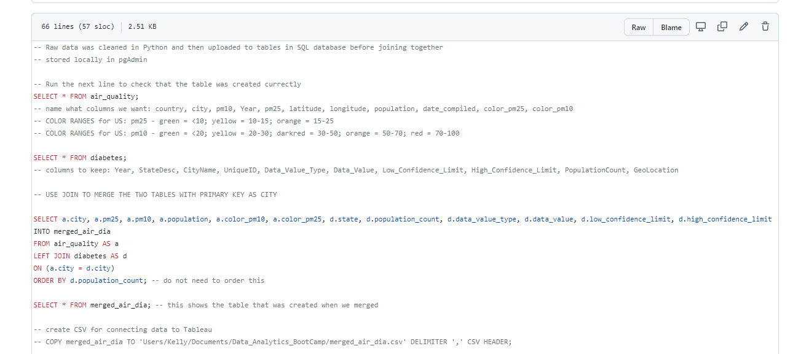
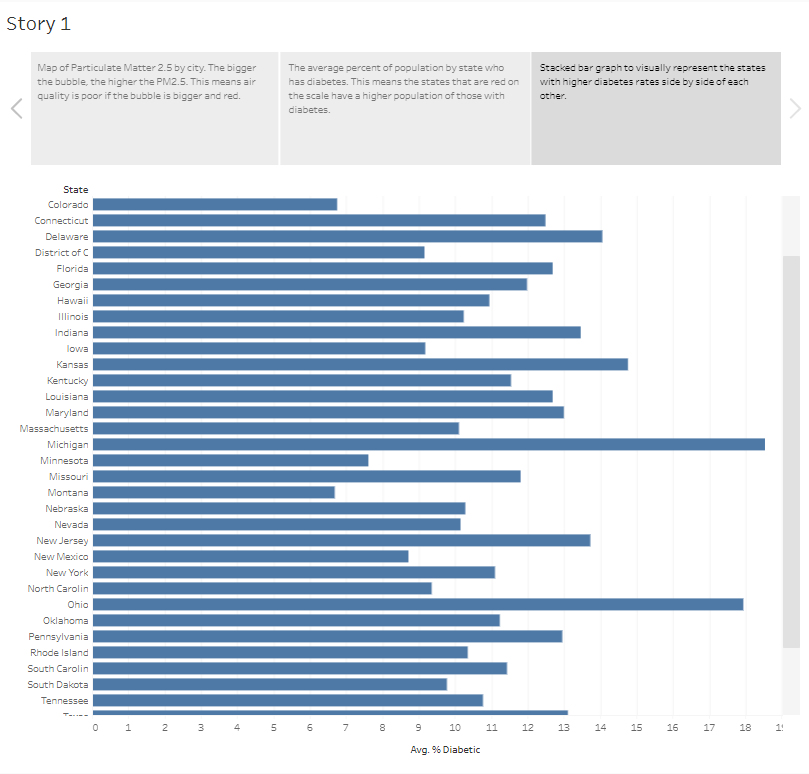
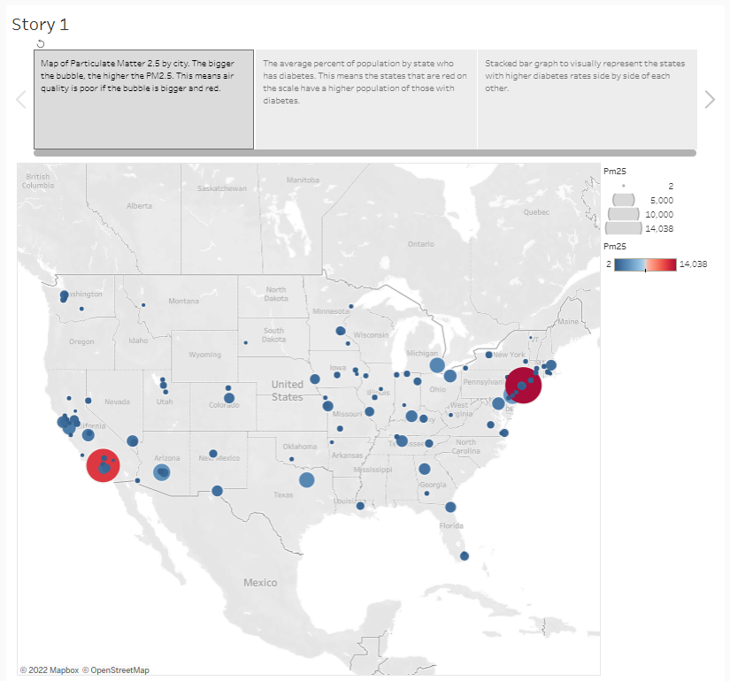
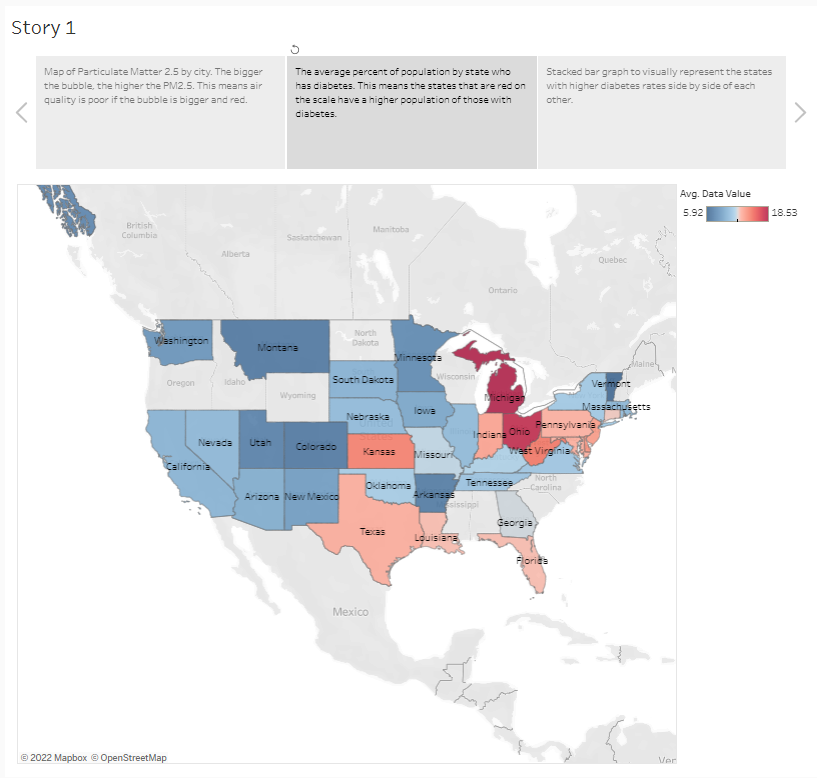

# group_7_project

Alyssa Stringer, Juana Suarez, Kelly Maluccio

## Index
Here's a description of the files we have in each folder, as well as the function of each file. 

### Raw_Data
The following files are the raw data we pulled from our sources in order to conduct the project:

- 500_asthma.csv
- 500_cancer.csv
- 500_diabetes.csv
- WHO_AirQuality_Database_2018.csv

### cleaning_data
This folder contains the python files for cleaning both the 500_asthma.csv data as well as the 500_diabetes.csv data. The schema.sql file is the SQL code used to join the dataframes together to create our dataset. 

- clean_asthma_data_for_sql.ipynb
- clean_dia_data_for_sql.ipynb
- schema.sql

### data_csv
This folder holds the two CSV files wiith our merged, cleaned data from the original data sources. These were created via PgAdmin using the schema.sql code.

- merged_air_asthma.csv
- merged_air_dia.csv

### images
These contain images, screenshots of data, graphs, all relevent resources included in the readme. 

### machine_learning
This folder contains the two python files that loaded our data_csv files in to perform Linear Regression Machine Learning for both the ashtma data and the diabetes data.

- Machine_learning_model_asthma.ipynb
- Machine_learning_model_diabetes.ipynb

## Project Content

Below is a list answering basic questions about our project and describing our plan for the project.

### Selected topic: 
- We are predicting common diseases that impact majority of Americans, such as diabetes, cancer and asthma, based on air quality from 500 different U.S. cities

### Reason for topic: 
- Being health conscious is important to our group members. Whether cancer, obesity, or mental health, we all know someone close to us who suffers from health issues. The conversation led us to a discussion about external factors affecting health. How does air quality, population, and state predict the prevalence of various diseases in cities? 

### Description of source data: 
- Our group found data from the [CDC website](https://www.cdc.gov/places/) on diseases, and data from the World Health Organization on air quality data through [Kaggle](https://www.kaggle.com/datasets/erelin6613/ambient-air-quality-database-who?resource=download). We were able to merge both data sets by city. Our project will be able to predict disease based on air quality, location, and population and identify the most affected cities with various diseases. 
-  Additional Resources: Follow this link to read an article that describes particle matter (PM) and its effect on health.
[Particle Matter and Health](https://ww2.arb.ca.gov/resources/inhalable-particulate-matter-and-health)

### Question(s) we want to answer: 
- Can we predict disease, such as diabetes or cancer, based on the city's air quality, state, and population?

## Presentation
[Link to Google Slides presentation](https://docs.google.com/presentation/d/1qG3MhF2sn1fkCNRhy3UWNuz9jSNbHSO7k6iK9xUxawY/edit?usp=sharing)

## GitHub and Communication
This week (May 16-22):
We worked together during and after class on the machine learning model. Kelly was assigned the presentation, Alyssa was assigned the Readme and Juana was assigned the dashboard. However, we all work closely together on each segment of the project.

# Project Outline:
1. We loaded our Database, the merged_air_dia.csv into a Jupyter Notebook python file in order to start the machine learning model process. We dropped the low and high confidence limit since these metrics were a high and low number of the data_value and upon data exploration we discovered was interfering with our model.
2. We then created three different dataframes in order to scale our data for the machine learning model. We used **OneHotEncoder** to scale the color_pm25 (colors to indicate high, medium or low PM2.5 levels for air quality), color_pm10 (colors to indicate high, medium or low PM10 levels for air quality) and data_value_type, which indicates between two types of rates that are utilized in the MOPHIMS MICA system: crude and age-adjusted rates.
        
        Air Quality data metrics that determine air quality:
        - PM10 is any particulate matter in the air with a diameter of 10 micrometers or less, including smoke, dust, soot, salts, acids, and metals.
        - PM2.5 is fine particulate matter. PM2.5 is an air pollutant that is a concern for people's health when levels in air are high. PM2.5 are tiny particles in the air that reduce visibility and cause the air to appear hazy when levels are elevated. 
     
        Therefore, high levels of PM2.5 or PM10 is what we are looking for that we believe correlates with high levels of disease based on location.

        Diabetes data metrics:
        Data Value Type is between two types of rates that are utilized in the MOPHIMS MICA system: crude and age-adjusted rates:
        1. Crude Prevalence is defined as the total number of events, or count, divided by the mid-year total population of the selected geography and multiplied by a constant, which is a multiple of 10.
        2. Age-Adjusted rates allows fairer comparisons to be made between groups with different age distributions. So if there are more elderly people in the population, there could be higher disease rates.
        - Data Value is the number value given based on the above rates, or the percentage of people with the disease.

3. We used **pandas get_dummies** to scale the unique zip, however we didn't end up running it because it took up too much time to run. We also were getting too many errors and needed the accuracy score so we needed to take this out in order to run quickly for our scores. We used **StandardScaler** to scale pm10, pm2.5 and population. 
4. Now with the three scaled datasets, we combined them together using concat to create a new, scaled dataframe ready to be used for Machine Learning.

## Machine Learning Model

According to [this study](https://www.ncbi.nlm.nih.gov/pmc/articles/PMC5583950/#:~:text=The%20positive%20associations%20between%20PM,25%25%20in%20the%20long%E2%80%90term), PM 2.5 is the most significantly linked to diabetes. The Results section says, "every 10-μg/m3 increase in PM2.5, the risk of type 2 diabetes mellitus would increase by 25% in the long-term exposure." Our group looked at PM 2.5 and PM 10 data to see if it would predict the percentage of the population with diabetes. 

### Splitting our data into X and y
- X = Data_Value: The percentage of people in that city with Diabetes
- y = The rest of the scaled features:
    - color_pm10
    - color_pm25
    - data_value_type
    - population
    - pm25
    - pm10

The formula for multiple linear regression is:

Benchmarks according to the WHO_AirQuality_Database_2018.csv for pm 2.5 and  pm 10: 

Green  = Air quality is satisfactory, and air pollution poses little or no risk.

Yellow = Air quality is acceptable. However there may be a risk for some people, particularly those who are unusually sensitive to air pollution. 

Orange = Members of sensitive groups may experience health effects. The General public is less likely to be affected. 

Dark Red = Some members of the general public may experience health effects; members of sensitive groups may experience more serious health effects.

pm 2.5:
- <10 = green
- 10-<15 = yellow
- 15-<25 = orange

pm 10 
- <20 = green
- 20 - <30 = yellow
- 30-<50 = dark red

### Splitting into training and testing sets

To split into training and testing sets, we will use sklearn.model_selection.train_test_split with the features above. Reference this [medium article](https://medium.com/@sametgirgin/multiple-linear-regression-model-in-7-steps-with-python-f02dbb13c51e) as an example of a multiple linear regression with test and train data. 

### Fitting the Model
It took us 0:00:00.023708 time to fit the model, run on a computer with memory: 4 GB 1600 MHz DDR3 and processor: 1.6 GHz Dual-Core Intel Core i5. 

### Results:
#### OLS Regression Results using y_test and x_test

Looking at the OLS Regression Summary, we have a high chance for error in our machine learning model. We have a 0.069 chance of being accurate which is very low. However, this is our preliminary model and we now will perform an analysis to determine how to better our fit our model. We have identified the coefficients that could be contributing to the low accuracy of our model and we can make adjustments accordingly.

#### Sklearn.metrics using y_test and y_pred

Mean absolute error (MAE): represents the difference between the original and the predicted values by averaging their absolute difference of the whole dataset

Mean squared error (MSE): represents the difference between the original and predicted values, by squaring the average difference over the dataset

We want the MAE and MSE numbers to be as close to 0 as possible, so we need to adjust our model in order to bring these numbers down closer to 0. This our starting point/benchmark that we are trying to lower. We want our R-2 number to be as close to 1 as possible, which means our current R-2 of 0.068 is our benchmark and we need to better fit our model to bring that number closer to 1 for better accuracy.

## Database

For our database, we first loaded the raw data (CSV files) for the air quality and diabetes data into python. In python, we created two dataframes with the necessary columns for the data analysis. This is where we cleaned the data and then used SQL Alchemy to store the data as two tables in pgAdmin. Once the python code runs, then we go to the schema.sql file and run the code that joins the two tables together. This merged table is exported to a CSV file which we connect to Tableau. If we paid for the service, we could connect to the server in Tableau and would not need to export another CSV file to access our database.

## Dashboard

To create our storyboard we are using Tableau as our tool. We connect Tableau to our database and then create visualizations for the storyboard. Our interactive elements will be the visualizations of our data including a map of all US cities that are in the dataset and graphs to compare the particle matter values for each city with percentage of the population with diabetes.

[Link to Tableau Public](https://public.tableau.com/views/AirQualityVDiabetes/Story1?:language=en-US&publish=yes&:display_count=n&:origin=viz_share_link)
 

A stacked bar graph to visually represent the states diabetes rates side by side one another.

A map of particulate matter 2.5 (PM25) by city. This means air quality is poor in ciities where the circle is larger and red compared to small blue circles.

A map of the avg percent of population per state with diabetes. This means the states that are more red have a higher population of people with diabetes.

Interactive elements:
Hover over each city bubble to see air quality level, and the percentage of people with diabetes in that city.
